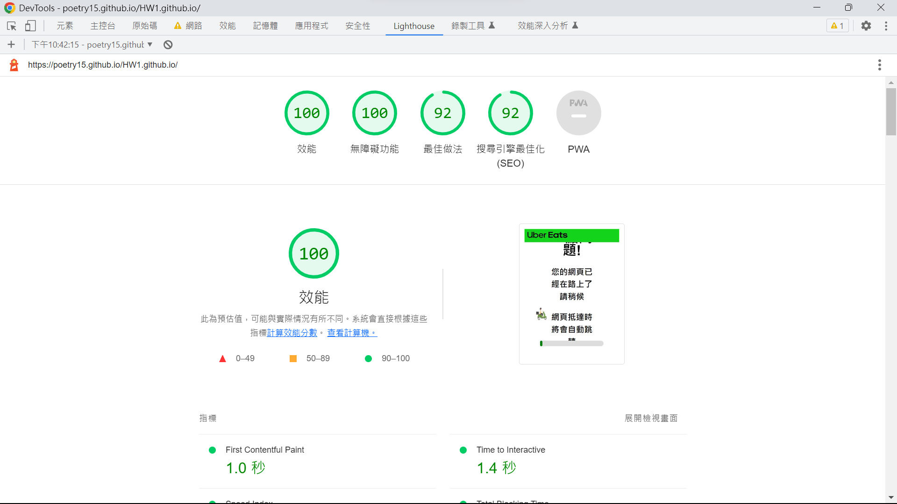
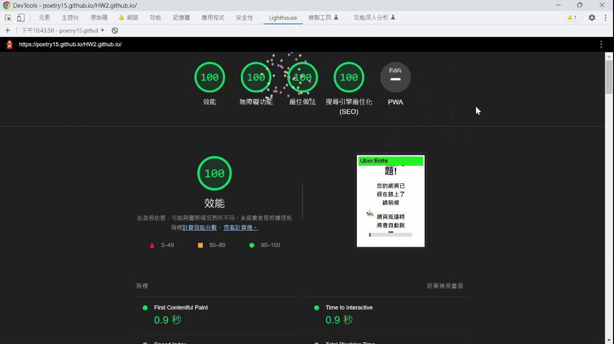

# Web程式設計 HW2 前端效能調校-當機等候網頁

# 調校前結果:384分

原始網頁：[https://poetry15.github.io/HW1.github.io/](https://poetry15.github.io/HW1.github.io/)

[HW1 負評救星-當機等候網頁](https://www.notion.so/HW1-783926da46f4488eacbcce35fcc253c5?pvs=21)



# 最佳化建議&診斷

### 關閉擴充功能

### 建議


### 做法：將擴充功能ruffle調至「當你點選擴充功能時」

原始


調校過後


### 更換圖片格式

### 建議


### 做法：將png檔更換成webp檔

原始

```html
<div class="progress-bar">
        
        <div class="progress"></div>
```

調校過後

```html
<div class="progress-bar">
        
        <div class="progress"></div>
```

# 最佳做法

## 使用者體驗

### 建議


### 做法：將minHeight更改成auto

原始

```jsx
function updateProgress(){
img.style.minWidth = '50px';
img.style.minHeight = '50px';
          .
          .
}
```

調校過後

```jsx
function updateProgress(){
img.style.minWidth = '50px';
img.style.minHeight = 'auto';
          .
          .
}
```

# 搜尋引擎最佳化(SEO)

## 內容最佳做法

### 建議


### 做法：在<head>的地方增加description

原始

```html
<head> <!-- 網頁的標頭 -->
    <meta charset="UTF-8"> <!-- 設定文件編碼為 UTF-8 -->
    <meta name="viewport" content="width=device-width,initial-scale=1">
    <title>當機網頁</title> <!-- 設定網頁標題 -->
    <link rel="stylesheet" href="style.css"> <!-- 引用 CSS 樣式表 -->
</head>
```

調校過後

```html
<head> <!-- 網頁的標頭 -->
    <meta charset="UTF-8"> <!-- 設定文件編碼為 UTF-8 -->
    <meta name="viewport" content="width=device-width,initial-scale=1">
    <meta name="description" content="Ubereat waiting website for customer wait for website link.">
    <title>當機網頁</title> <!-- 設定網頁標題 -->
    <link rel="stylesheet" href="style.css"> <!-- 引用 CSS 樣式表 -->
</head>
```

# 調校後結果:400分

調校後網址：[https://poetry15.github.io/HW2.github.io/](https://poetry15.github.io/HW2.github.io/)


